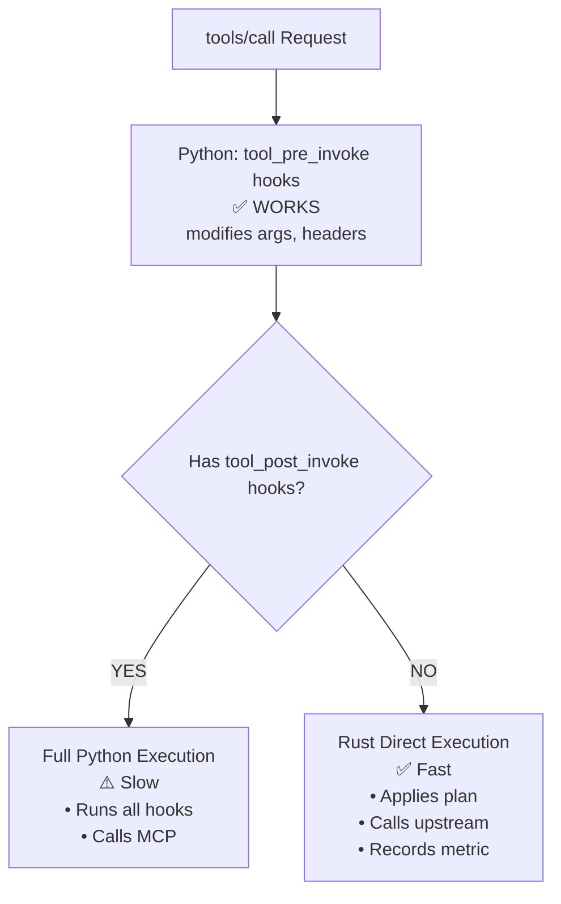
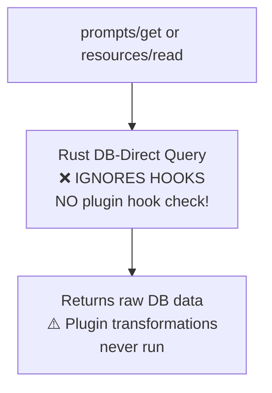

# Bug Analysis: Rust MCP Plugin Hook Semantics Inconsistency

## 📋 Problem Summary

The Rust MCP execution path does not consistently preserve plugin hook semantics. There are **three different behaviors** depending on the hook family:

| Hook Type | Rust Path Behavior | Issue |
|-----------|-------------------|-------|
| **`tool_pre_invoke`** | ✅ Supported | Python runs hook, Rust applies the resulting plan |
| **`tool_post_invoke`** | ⚠️ Forces Python fallback | Forces complete fallback to Python execution |
| **`prompt_*` / `resource_*`** | ❌ Not consulted | Not checked on Rust DB-direct paths, hooks silently skipped |

This is both a **correctness bug** and a **performance/parity gap**.

---

## 🔍 Detailed Analysis

### 1. `tool_post_invoke` Forces Python Fallback

When a `tool_post_invoke` hook is registered (e.g., `RetryWithBackoffPlugin`, `CircuitBreakerPlugin`), Rust **cannot** execute the tool directly. Instead, it must fall back to full Python execution.

**Location:**
```python
# mcpgateway/services/tool_service.py:2908
async def prepare_rust_mcp_tool_execution(self, ...):
    has_pre_invoke = self._plugin_manager and self._plugin_manager.has_hooks_for(ToolHookType.TOOL_PRE_INVOKE)
    has_post_invoke = self._plugin_manager and self._plugin_manager.has_hooks_for(ToolHookType.TOOL_POST_INVOKE)

    # Post-invoke hooks cannot run after Rust upstream execution; force fallback
    if has_post_invoke:
        return {"eligible": False, "fallbackReason": "post-invoke-hooks-configured"}
```

**Why this is a problem:**
- Post-invoke hooks (circuit breaker, retry, summarizer, output validation) **cannot benefit** from Rust's fast path
- All tool calls with post-invoke hooks lose the performance benefit of Rust direct execution
- This defeats the purpose of having Rust acceleration for hot paths

**Affected plugins:**
- `RetryWithBackoffPlugin` - retry logic with exponential backoff
- `CircuitBreakerPlugin` - circuit breaker for failing tools
- `ToolOutputSentinelPlugin` - output validation/sanitization
- Any custom plugin using `tool_post_invoke`

---

### 2. `prompt_*` and `resource_*` Hooks Ignored on Rust DB-Direct Paths

When Rust runs in `full` mode, it can directly query the database for read-only operations:
- `prompts/list`, `prompts/get`
- `resources/list`, `resources/read`
- `resources/templates/list`

**The Problem:** These direct paths **do not check** whether active plugin hooks are registered. This means:
- Active hooks may be **silently skipped**
- Plugins like `PIIFilterPlugin`, `LicenseHeaderInjector`, `DenyListPlugin` **never execute**
- Plugin behavior differs between Python and Rust paths (correctness bug)

**Example from code:**
```rust
// tools_rust/mcp_runtime/src/lib.rs
// Rust directly queries DB without checking for plugin hooks
pub async fn direct_server_prompts_get(
    state: &AppState,
    server_id: &str,
    prompt_id: &str,
    auth_context: &AuthContext,
) -> Result<Value, RuntimeError> {
    // No plugin hook check here!
    let rows = client.query(
        "SELECT p.name, p.description, p.template... FROM prompts p...",
        &[&server_id, &prompt_id]
    ).await?;
    // Returns raw DB data without plugin transformations
}
```

**Contrast with Python path:**
```python
# mcpgateway/services/prompt_service.py
async def get_prompt(self, db: Session, prompt_id: str, ...):
    # Check for plugin hooks
    has_pre_fetch = self._plugin_manager.has_hooks_for(PromptHookType.PROMPT_PRE_FETCH)
    has_post_fetch = self._plugin_manager.has_hooks_for(PromptHookType.PROMPT_POST_FETCH)

    # Execute pre-fetch hooks
    if has_pre_fetch:
        pre_payload = PromptPreFetchPayload(prompt_id=prompt_id, arguments=arguments)
        pre_result, contexts = await self._plugin_manager.invoke_hook(...)

    # Fetch from DB
    prompt = db.query(DbPrompt).filter(...).first()

    # Execute post-fetch hooks
    if has_post_fetch:
        post_payload = PromptPostFetchPayload(prompt=prompt, messages=messages)
        post_result, contexts = await self._plugin_manager.invoke_hook(...)
```

---

## 📊 Visual Flow Diagram

### tools/call Request Flow



### prompts/get or resources/read Flow



---

## 🎯 Why This Matters

### Correctness Issues

1. **Plugin behavior is unpredictable** - same plugin may or may not run depending on execution path
2. **Security policies can be bypassed** - `DenyListPlugin`, `PIIFilterPlugin` may not execute
3. **Data transformations are lost** - `LicenseHeaderInjector`, output sanitization skipped

### Performance Issues

1. **Post-invoke plugins force slow path** - all tools with post-invoke hooks lose Rust acceleration
2. **No clear documentation** - users don't know which plugins affect performance
3. **Silent degradation** - no warning when hooks cause fallback

---

## 🔧 Required Fixes

### Fix 1: Add Plugin Hook Checks to Rust DB-Direct Paths

**For `prompts/get` and `resources/read`:**

```rust
// tools_rust/mcp_runtime/src/lib.rs
pub async fn direct_server_prompts_get(...) {
    // NEW: Check if plugin hooks are registered
    let has_hooks = check_plugin_hooks_for_prompt(state, prompt_id).await?;
    if has_hooks {
        warn!("Plugin hooks registered; falling back to Python");
        return forward_to_backend(state, incoming_headers).await;
    }

    // Existing DB query logic...
}
```

**Implementation steps:**
1. Add internal endpoint `/_internal/mcp/plugin-hooks/check` in Python
2. Rust calls this endpoint before DB-direct operations
3. If hooks active → fallback to Python
4. If no hooks → proceed with DB-direct

### Fix 2: Document or Implement `tool_post_invoke` in Rust

**Option A: Document the limitation**
```markdown
## Known Limitations

- `tool_post_invoke` hooks force Python execution fallback
- Affected plugins: RetryWithBackoffPlugin, CircuitBreakerPlugin, etc.
- Future work: implement post-invoke hook execution in Rust
```

**Option B: Implement post-invoke in Rust**
```rust
// After direct tool execution
if has_post_invoke {
    let post_payload = ToolPostInvokePayload { result: tool_result };
    let post_result = call_python_plugin_hook("tool_post_invoke", post_payload).await?;
    tool_result = post_result.result;
}
```

---

## 📁 Key Files

| Component | File | Lines |
|-----------|------|-------|
| **Tool execution plan** | `mcpgateway/services/tool_service.py` | 2858-2908 |
| **Rust DB-direct prompts** | `tools_rust/mcp_runtime/src/lib.rs` | ~5000-6000 |
| **Rust DB-direct resources** | `tools_rust/mcp_runtime/src/lib.rs` | ~6000-7000 |
| **Python prompt service** | `mcpgateway/services/prompt_service.py` | 2100-2500 |
| **Python resource service** | `mcpgateway/services/resource_service.py` | 2130-2450 |
| **Plugin hook config** | `plugins/config.yaml` | 1-1068 |
| **Follow-up tracking** | `tools_rust/mcp_runtime/FOLLOWUPS.md` | 251-400 |

---

## 🧪 Testing Strategy

### Current Plugin Parity Tests

```bash
# Run plugin parity tests
PLUGINS_CONFIG_FILE=plugins/plugin_parity_config.yaml make testing-rebuild-rust-full
MCP_PLUGIN_PARITY_EXPECTED_RUNTIME=rust make test-mcp-plugin-parity
```

**What it tests:**
- `resources/read` + `LicenseHeaderInjector` (resource_post_fetch)
- `tools/call` + `ToolOutputSentinelPlugin` (tool_post_invoke)
- `prompts/get` + `PromptOutputSentinelPlugin` (prompt_post_fetch)

### Additional Tests Needed

1. **Deny-path tests** - verify hooks block access correctly
2. **Fallback detection** - verify Rust→Python fallback when hooks active
3. **Performance regression** - measure impact of post-invoke fallback

---

## 📚 Related Documentation

- **Plugin Framework Spec:** `docs/docs/architecture/plugins.md`
- **Rust Plugins Guide:** `docs/docs/using/plugins/rust-plugins.md`
- **Rust MCP Runtime Arch:** `docs/docs/architecture/rust-mcp-runtime.md`
- **ADR-043 (Rust Sidecar):** `docs/docs/architecture/adr/043-rust-mcp-runtime-sidecar-mode-model.md`
- **RBAC & Token Scoping:** `docs/docs/manage/rbac.md`

---

## 🎯 Success Criteria

After fixes are implemented:

1. ✅ All plugin hooks either execute OR trigger Python fallback (no silent skips)
2. ✅ Clear logging when Rust→Python fallback occurs due to hooks
3. ✅ Plugin parity tests pass for both Python and Rust runtimes
4. ✅ Documentation updated with known limitations
5. ✅ Performance benchmarks show expected behavior

---

## 📝 Notes

- This is a **follow-up** from the Rust MCP runtime implementation
- The issue was identified during plugin parity testing
- Priority: **High** (correctness + security implications)
- Estimated effort: **Medium** (requires changes in both Python and Rust)

---

*Generated: 2026-03-30*
*Author: Analysis from bug ticket and codebase exploration*
