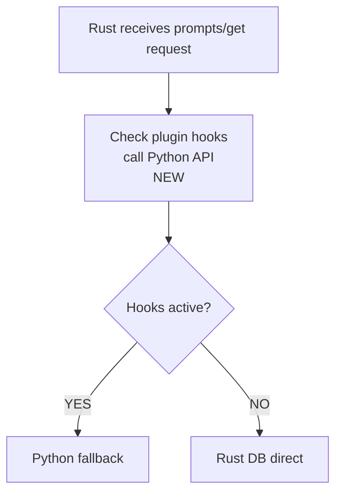

# Fix Plan: Rust MCP Plugin Hook Parity

## 📋 Summary

We need to ensure plugin hooks **either execute OR explicitly trigger Python fallback**.
Currently, some hooks are silently skipped in Rust DB-direct paths.

---

## ✅ Fix 1: Add Hook Check for `prompts/get`

### File 1: `mcpgateway/main.py`

**Add new internal endpoint** for prompt hook checking:

```python
# Find line ~8979 (where /tools/call/resolve is)
# Add after it:

@utility_router.post("/_internal/mcp/prompts/get/check-hooks")
async def check_prompt_hooks(
    request: Request,
    db: Session = Depends(get_db),
) -> Dict[str, Any]:
    """Check if any prompt_post_fetch hooks are active.
    
    Rust MCP runtime calls this before direct DB queries for prompts/get.
    Returns {"has_active_hooks": True/False, "fallback_reason": "..."}
    """
    from mcpgateway.plugins.framework.manager import PluginManager
    
    plugin_manager = request.app.state.plugin_manager
    if not plugin_manager:
        return {"has_active_hooks": False}
    
    # Check if any prompt_post_fetch hooks are registered and active
    has_hooks = plugin_manager.has_hooks_for(PromptHookType.PROMPT_POST_FETCH)
    
    if has_hooks:
        return {
            "has_active_hooks": True,
            "fallback_reason": "prompt-post-fetch-hooks-configured"
        }
    
    return {"has_active_hooks": False}
```

### File 2: `tools_rust/mcp_runtime/src/lib.rs`

**Find function** `direct_server_prompts_get` (approximately line 5500-6000):

```rust
// CURRENT CODE (approximately):
pub async fn direct_server_prompts_get(
    state: &AppState,
    server_id: &str,
    prompt_id: &str,
    auth_context: &AuthContext,
) -> Result<Value, RuntimeError> {
    // Immediately queries DB - NO HOOK CHECK
    let rows = client.query(...).await?;
    ...
}
```

**Replace with:**

```rust
pub async fn direct_server_prompts_get(
    state: &AppState,
    server_id: &str,
    prompt_id: &str,
    auth_context: &AuthContext,
    incoming_headers: &HeaderMap,
) -> Result<(StatusCode, Value), RuntimeError> {
    
    // NEW: Check plugin hooks before DB query
    let hooks_response = state
        .client
        .post(&state.backend_prompts_get_check_hooks_url)
        .headers(incoming_headers.clone())
        .json(&json!({
            "prompt_id": prompt_id,
            "server_id": server_id
        }))
        .send()
        .await
        .map_err(|e| RuntimeError::Config(format!("Hook check failed: {}", e)))?
        .json::<Value>()
        .await
        .map_err(|e| RuntimeError::Config(format!("Hook check parse failed: {}", e)))?;
    
    // If hooks are active → fallback to Python
    if hooks_response.get("has_active_hooks").and_then(|v| v.as_bool()) == Some(true) {
        let reason = hooks_response
            .get("fallback_reason")
            .and_then(|v| v.as_str())
            .unwrap_or("prompt-hooks-active");
        
        warn!("Prompt hooks active; falling back to Python: {}", reason);
        return forward_to_backend(state, incoming_headers).await;
    }
    
    // Continue with DB query (existing code)
    let rows = client.query(...).await?;
    ...
}
```

---

## ✅ Fix 2: Add Hook Check for `resources/read`

### File 1: `mcpgateway/main.py`

**Add another endpoint**:

```python
@utility_router.post("/_internal/mcp/resources/read/check-hooks")
async def check_resource_hooks(
    request: Request,
    db: Session = Depends(get_db),
) -> Dict[str, Any]:
    """Check if any resource_post_fetch hooks are active.
    
    Rust MCP runtime calls this before direct DB queries for resources/read.
    """
    from mcpgateway.plugins.framework.manager import PluginManager
    
    plugin_manager = request.app.state.plugin_manager
    if not plugin_manager:
        return {"has_active_hooks": False}
    
    # Check if any resource_post_fetch hooks are registered and active
    has_hooks = plugin_manager.has_hooks_for(ResourceHookType.RESOURCE_POST_FETCH)
    
    if has_hooks:
        return {
            "has_active_hooks": True,
            "fallback_reason": "resource-post-fetch-hooks-configured"
        }
    
    return {"has_active_hooks": False}
```

### File 2: `tools_rust/mcp_runtime/src/lib.rs`

**Find function** `direct_server_resources_read` (approximately line 6500-7000):

```rust
// Add hook check at the beginning of the function, similar to prompts/get:

pub async fn direct_server_resources_read(
    state: &AppState,
    server_id: &str,
    resource_id: &str,
    auth_context: &AuthContext,
    incoming_headers: &HeaderMap,
) -> Result<(StatusCode, Value), RuntimeError> {
    
    // NEW: Check plugin hooks
    let hooks_response = state
        .client
        .post(&state.backend_resources_read_check_hooks_url)
        .headers(incoming_headers.clone())
        .json(&json!({
            "resource_id": resource_id,
            "server_id": server_id
        }))
        .send()
        .await
        .map_err(|e| RuntimeError::Config(format!("Hook check failed: {}", e)))?
        .json::<Value>()
        .await
        .map_err(|e| RuntimeError::Config(format!("Hook check parse failed: {}", e)))?;
    
    if hooks_response.get("has_active_hooks").and_then(|v| v.as_bool()) == Some(true) {
        warn!("Resource hooks active; falling back to Python");
        return forward_to_backend(state, incoming_headers).await;
    }
    
    // Continue with DB query (existing code)
    ...
}
```

---

## ✅ Fix 3: Add URLs to AppState

### File: `tools_rust/mcp_runtime/src/lib.rs`

**Find struct** `AppState` (approximately line 100-150):

```rust
pub struct AppState {
    // ... existing fields ...
    backend_tools_call_resolve_url: Arc<str>,
    backend_tools_call_metric_url: Arc<str>,
    
    // ADD:
    backend_prompts_get_check_hooks_url: Arc<str>,
    backend_resources_read_check_hooks_url: Arc<str>,
}
```

**Find function** `create_app_state` (approximately line 200-300):

```rust
pub fn create_app_state(config: &RuntimeConfig) -> Result<AppState, RuntimeError> {
    let backend_url = &config.backend_url;
    
    // ... existing URLs ...
    
    // ADD:
    let backend_prompts_get_check_hooks_url = 
        format!("{}/_internal/mcp/prompts/get/check-hooks", backend_url);
    let backend_resources_read_check_hooks_url = 
        format!("{}/_internal/mcp/resources/read/check-hooks", backend_url);
    
    Ok(AppState {
        // ... existing fields ...
        backend_prompts_get_check_hooks_url: backend_prompts_get_check_hooks_url.into(),
        backend_resources_read_check_hooks_url: backend_resources_read_check_hooks_url.into(),
    })
}
```

---

## 📝 Summary of Changes

| # | File | What to do | Lines |
|---|------|------------|-------|
| 1 | `mcpgateway/main.py` | Add 2 hook check endpoints | ~40 |
| 2 | `tools_rust/mcp_runtime/src/lib.rs` | Modify 2 functions + AppState | ~80 |
| 3 | `tools_rust/mcp_runtime/src/lib.rs` | Add 2 URLs to AppState | ~10 |

---

## 🧪 How to Test

### Step 1: Run with plugins enabled

```bash
# Enable plugins with active hooks
export PLUGINS_CONFIG_FILE=plugins/plugin_parity_config.yaml
export RUST_MCP_MODE=full

# Start the stack
make testing-rebuild-rust-full
```

### Step 2: Verify fallback

```bash
# Request prompts/get should return Python runtime header
curl -sD - http://localhost:8080/mcp \
  -H "Content-Type: application/json" \
  -d '{"jsonrpc":"2.0","method":"prompts/get","params":{"name":"test"}}' \
  | grep "x-contextforge-mcp-runtime"

# Expected: x-contextforge-mcp-runtime: python
# (because hooks are active → fallback)
```

### Step 3: Check logs

```bash
# Rust logs should show:
# "Prompt hooks active; falling back to Python: prompt-post-fetch-hooks-configured"
docker logs contextforge-rust-1 2>&1 | grep "falling back"
```

---

## 🎯 Definition of Done

- [ ] Endpoints `/_internal/mcp/prompts/get/check-hooks` and `/_internal/mcp/resources/read/check-hooks` are added
- [ ] Rust functions `direct_server_prompts_get` and `direct_server_resources_read` check for hooks
- [ ] When hooks are active, Rust falls back to Python
- [ ] Logs show fallback messages
- [ ] Tests `make test-mcp-plugin-parity` pass

---

## ❓ If Something is Unclear

1. **Can't find function in Rust?** - Ask me to locate the exact file/line
2. **Don't understand how to add endpoint?** - I'll show an example in `main.py`
3. **Need help with Rust compilation?** - We'll run `make -C tools_rust/mcp_runtime build`

---

## 📊 Flow Diagram



---

*Created: 2026-03-30*
*Author: Bug analysis from codebase exploration*
